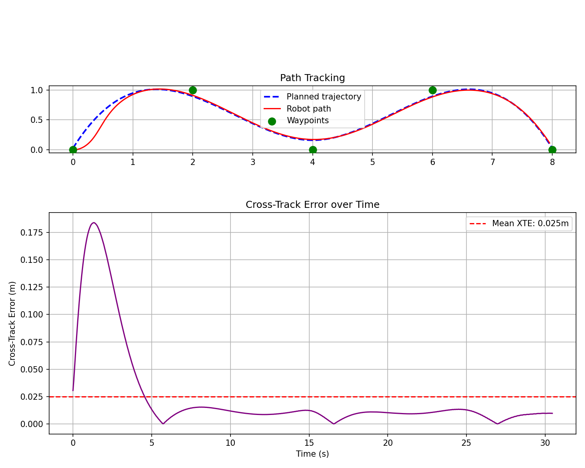
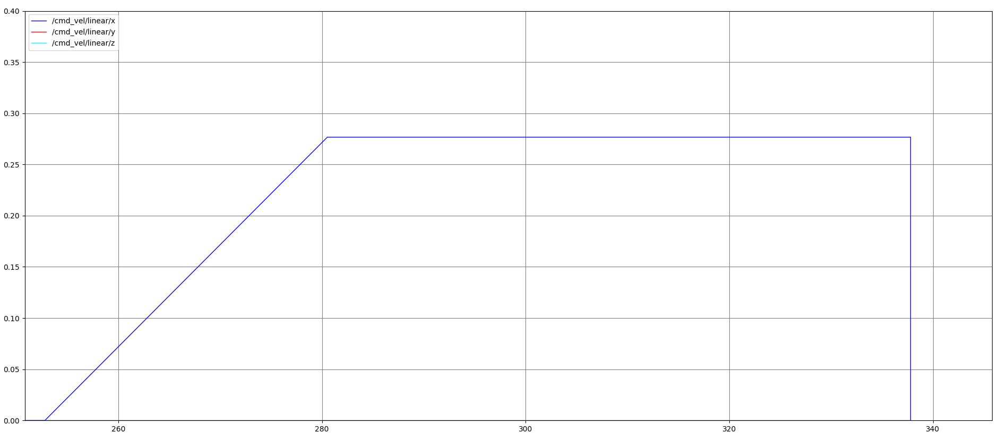

# Trajectory Tracking & Path Smoothing for Differential Drive Robots

This ROS 2 package provides a Path Smoothing and Trajectory Tracking action server for the TurtleBot 4. You give it discrete 2D waypoints, and it generates a smooth time-parameterized trajectory and tracks it using a Pure Pursuit controller. It also includes dynamic obstacle avoidance.

## Table of Contents
1. [Setup and Execution](#setup-and-execution)
2. [Design Choices and Architecture](#design-choices-and-architecture)
3. [Extending to a Real Robot](#extending-to-a-real-robot)
4. [Additional Implementation: Obstacle Avoidance](#additional-implementation-obstacle-avoidance)
5. [AI Tools Used](#ai-tools-used)

---

## Setup and Execution

### Prerequisites
- ROS 2 Humble
- `turtlebot4_simulator` package
- Python 3 with `numpy` and `scipy`

### Installation
1. Clone this package into the `src` folder of your ROS 2 workspace:
   ```bash
   cd ~/tbot4_ws/src
   git clone <repository_url> trajectory_tracking
   ```
2. Install Python dependencies:
   ```bash
   pip install scipy numpy
   ```
3. Build the workspace:
   ```bash
   cd ~/tbot4_ws
   colcon build --packages-select trajectory_tracking
   source install/setup.bash
   ```
 Note: A custom [world](worlds/plain.world) was used to test all of this out, 

### Execution

1. **Launch the Simulation:**
   ```bash
   ros2 launch turtlebot4_ignition_bringup ignition.launch.py
   ```

2. **Run the Action Server:**
   ```bash
   ros2 launch trajectory_tracking tracking.launch.py
   ```
   Or directly:
   ```bash
   ros2 run trajectory_tracking follow_trajectory_server
   ```

3. **Send a Goal:**
   ```bash
   ros2 action send_goal /follow_trajectory turtlebot4_msgs/action/FollowTrajectory \
     "{waypoints: [
       {x: 0.0, y: 0.0, theta: 0.0},
       {x: 2.0, y: 1.0, theta: 0.0},
       {x: 4.0, y: 0.0, theta: 0.0},
       {x: 6.0, y: 1.0, theta: 0.0},
       {x: 8.0, y: 0.0, theta: 0.0},
       {x: 7.0, y: 3.0, theta: 0.0},
       {x: 6.0, y: 2.0, theta: 0.0},
       {x: 4.0, y: 3.0, theta: 0.0},
       {x: 3.0, y: 2.0, theta: 0.0},
     ]}"
   ```
   > Note: Only the `x` and `y` fields are used. `theta` is accepted by the message type but ignored — heading is derived from the path direction.

4. **Visualization in RViz:**
   Add the following topics to see planning in real-time:
   - `/input_waypoints` — `visualization_msgs/MarkerArray` (green=start, red=goal, cyan=intermediate)
   - `/trajectory_path` — `nav_msgs/Path` (original planned path)
   - `/replanned_trajectory` — `nav_msgs/Path` (appears when bypassing an obstacle)

### Running Tests
```bash
colcon test --packages-select trajectory_tracking
colcon test-result --verbose
```
47 tests cover path smoothing, timing limits, controller outputs, and the replanner state machine.

**Results:**
Tested offline over an 8-metre sinusoidal path at 0.3 m/s:
- Mean cross-track error: **0.025m** (2.5cm)
- Max cross-track error: **0.184m** at sharpest curve apex
- 87.5% of timesteps within 5cm of planned path
- Final goal error: **0.099m** (within 0.25m tolerance)

To reproduce: `python3 scripts/plot.py` (from workspace root with `source install/setup.bash`)


---

## Design Choices and Architecture

The code is broken into specific Python modules that don't depend on ROS, making them easy to unit test. The main Action Server stitches them together.

### 1. Path Smoothing (`path_smoother.py`)
- **Algorithm:** B-Spline interpolation (`scipy.interpolate.splprep`).
- **Why:** Pure waypoints have sharp corners, making the robot stop and turn. B-Splines create a smoothed C² curve so the robot can stay moving.
- **Details:** Uses an adaptive smoothing factor (`s = n * 0.01`) instead of exact interpolation (`s=0.0`). Exact interpolation tends to cause huge oscillations if waypoints are placed very close together (like when the replanner drops bypass points). Fast duplicate point filtering runs before splining. Falls back to linear interpolation if you pass less than 4 points.

### 2. Trajectory Generation (`trajectory_generator.py`)
- **Algorithm:** Trapezoidal velocity profile.
- **Why:** Maps distances on the smooth path to actual timestamps, so the wheels aren't commanded to jerk to full speed instantly. It calculates an acceleration phase, a constant cruise phase (`max_vel`), and a deceleration phase matching the `total_time` parameter.
- **Short paths:** If the path is too short to hit `max_vel`, it steps down to a triangular profile (accel directly into decel).

### 3. Trajectory Tracking Controller (`pure_pursuit.py`)
- **Algorithm:** Pure Pursuit with Time-Parameterized Velocities.
- **Why:** Pure pursuit steers by chasing a spatial point ahead of the robot. This handles odometry drift well — if the robot gets delayed, it just looks further down the curve instead of winding up a PID integral error. But to make sure it obeys our trapezoidal plan, the linear velocity is now read directly from the timestamps of the current path segment.
- **Lookahead:** Currently set to `0.5m`. Shorter means tighter tracking but more wobbling; longer is smoother but cuts corners.
- **Stopping:** When the lookahead point runs off the end of the path, it steers straight for the goal and dials down the speed proportionally to the remaining distance.

Velocity graph for the robot executing a trajectory showcasing trapezoidal velocity profile
### 4. Action Server Architecture (`follow_trajectory_action_server.py`)
- **Setup:** A ROS 2 Action Server allows sending large waypoint arrays, tracking progress percentages, and cancelling goals properly.
- **Concurrency:** Uses `MultiThreadedExecutor`. This prevents the 20Hz control loop from getting blocked by `/odom` or `/scan` callbacks.
- **Locking:** `/scan` and `/odom` data are locked and captured simultaneously at the top of every loop iteration so the math uses matching sensor timelines.

---

## Extending to a Real Robot

Transitioning from TurtleBot 4 simulation to a physical differential-drive robot requires addressing several real-world imperfections:

1. **Odometry Drift:** Wheel slip ruins `/odom` quickly. You'll need to feed the controller a fused pose from an EKF or an AMCL localization map instead of raw wheel data.
2. **Control Lag:** Real motors can't handle instant velocity jumps. The `/cmd_vel` output should be piped through a velocity smoother node to enforce strict physical jerk limits.
3. **LiDAR Noise:** Real lidars get ghost reflections. Putting a median filter on the scan ranges and widening the `corridor_half_width` parameter will stop the replanner from panicking over noise.
4. **TF Frames:** Right now, the code assumes waypoints are given in the `odom` frame. On a real mapped robot, you'd give waypoints in the `map` frame, and the controller needs a TF listener to transform everything into `base_link` local coordinates dynamically.

---

## Additional Implementation: Obstacle Avoidance

The system dynamically bypasses unexpected obstacles at runtime using a geometric local planner in `path_replanner.py`.

### How It Works

**1. State Machine**
It uses two states: `NORMAL` (watching for obstacles) and `BYPASSING` (executing a detour). Blocking new replans while `BYPASSING` stops the robot from oscillating back and forth as the laser scan hits different parts of the same obstacle.

**2. Corridor Detection**
Every cycle, it checks a "corridor" stretching down the upcoming path. If lidar points hit inside that width, it sets a block. It uses the closest contact point (not the mean) so nearby walls don't warp the obstacle location.

**3. The Bypass Math**
- It casts a perpendicular ray out from the obstacle to find free space on the left or right.
- It drops two bypass waypoints (WP1 before the obstacle, WP2 past it).
- It checks that both points and the line between them are clear. (If it hits a wall on the left, it flips to try the right side).

**4. Hot-Swapping the Path**
It takes `[robot_pos, WP1, WP2, ...rest_of_original_path]`, runs it through the B-spline and profile generator again, and swaps the array inside the active Pure Pursuit controller. The robot smoothly veers around without stopping.

**5. Emergency Stop**
If an obstacle drops right in front of the robot (inside 0.35m `stop_distance`), it triggers an E-stop. The replanner loop keeps running while stopped, so the moment a clear bypass is found (or the obstacle moves), movement resumes.

### Testing Obstacle Avoidance

Spawn a static box obstacle in Gazebo:
```bash
ros2 run ros_gz_sim create \
  -world plain \
  -name test_box \
  -x 3.75 -y 0.0 -z 0.25 \
  -string "
<?xml version='1.0'?>
<sdf version='1.7'>
  <model name='test_box'>
    <link name='link'>
      <collision name='collision'>
        <geometry><box><size>0.5 0.5 0.5</size></box></geometry>
      </collision>
      <visual name='visual'>
        <geometry><box><size>0.5 0.5 0.5</size></box></geometry>
        <material><ambient>1 0 0 1</ambient><diffuse>1 0 0 1</diffuse></material>
      </visual>
    </link>
  </model>
</sdf>"
```

Send a goal that routes directly through the obstacle:
```bash
ros2 action send_goal /follow_trajectory turtlebot4_msgs/action/FollowTrajectory \
  "{waypoints: [
    {x: 0.0,  y:  0.0, theta: 0.0},
    {x: 3.75, y:  0.0, theta: 0.0},
    {x: 7.5,  y:  0.0, theta: 0.0}
  ]}"
```

Watch `/replanned_trajectory` appear in RViz as the robot detects the box and computes a bypass. The feedback status field will transition from `state=NORMAL` to `state=BYPASSING` and back to `state=NORMAL` after the obstacle is cleared.

---

## AI Tools Used
- **Perplexity + Claude 4.6 Sonnet:** Used for debugging and algorithmic consultation. Specifically, diagnosing string-tension math issues when B-splines were oscillating near closely packed bypass points, and architecting the two-state `BYPASSING` machine when the initial timer-based cooldown logic failed.
- **Google Antigravity:** Handled boilerplate Python/ROS 2 generation, typing help, and inline code refactoring to keep the workflow moving quickly. All core logic choices (Pure Pursuit, trapezoids, splines) were driven by me, using AI only as a proxy for writing code.
